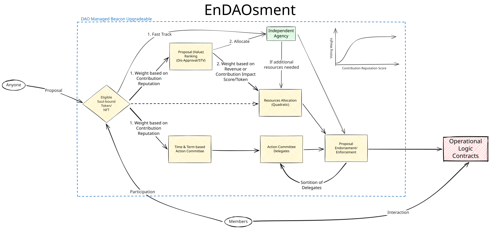

The EnDAOsment's modular governance framework utilizes a CORE contract that acts as a central hub, dynamically determining which governance module, either an Approval or Quadratic Governor, is invoked based on the current stage of a proposal. This modular design allows for a flexible and adaptable governance system that can evolve with the needs of the DAO. I believe that a decision involves two components: 
 - **Equitable Collective/Communal Value**
 - **Socioeconomically Sustainable Development**

Existing major DAO platforms lack a comprehensive multi-stage decision-making framework. To achieve this, I'd need to significantly customize my own smart contracts, so I might as well build a new platform from scratch. EnDAOsment's modular governance framework provides a robust and adaptable system for managing proposals within the DAO, allowing for different voting mechanisms to be applied based on the specific stage of a proposal and its maturity. 

**Modular Governance**: The framework utilizes a modular design, enabling the interchange and customization of governance components. This avoids the need for forking and rewriting entire contracts when adapting to changing needs or requirements.



Here's a breakdown of how this framework would operates:
1. **Governor General** [CORE Contract]: This central contract serves as the entry point for all governance proposals and holds the logic for determining which specific Governor contract to use at each stage of a proposal's lifecycle.
2. **Approval Governor**: This Governor handles proposals in their initial stages, requiring a simple approval threshold (or a designated set of approvers, 2/3) before progressing further. Focus on WHY we should go forward with the proposal.
3. **Quadratic Governor**: This Governor type, implemented using quadratic voting, is employed in the later stages of a proposal, allowing for more nuanced and weighted voting based on participants' preference intensity. Focus on HOW MUCH resources we should allocate and HOW we should implement the proposal.

Before we started this project, we looked at major DAO platforms like Aragon (too costly to customize), DAOStack (seems deprecated), and Colony (mainly focused on DeFi). In our view, a big problem with current DAO platforms and tools is that they vote on each proposal individually. In reality, proposals should be batched together within a single voting period due to bounded rationality, stemming from limited resources such as time, attention, information, money, and manpower. So, each voting period should be analogous to electing an official policymaker or executive. Voters would rank or approve proposals based on their qualitative and social value, and then use quadratic voting to rank them again based on available resources. For a given fiscal period, e.g., three months, there should ideally be only one major voting process for all participants to review, discuss, and collectively decide on initiatives.

---

## Technical Architecture & Core Contracts

### 1. ERC-1155 Soulbound Token (`contracts/MemberToken.sol`)
- Implements standard `ERC1155Upgradeable` soulbound badges (`SoulboundTokenTransferDisabled` on standard transfers).
- Integrated with OpenZeppelin's `Checkpoints.Trace208` to provide historical balance lookups (`getPastBalanceOf(account, tokenId, timepoint)`) at snapshot blocks.
- Fully upgradeable via `UUPSUpgradeable` with reserved storage gaps.

### 2. Contribution Reputation Score (`contracts/ICrsManager.sol`)
- Standardized interface querying reputation scores per account and badge ID:
  ```solidity
  function getCrs(address account, uint256 tokenId) external view returns (uint256);
  function getPastCrs(address account, uint256 tokenId, uint256 timepoint) external view returns (uint256);
  ```

### 3. Stage 1: Approval Voting (`contracts/ApprovalGovernor.sol`)
- Stage 1 Proposal Value Ranking weighted by CRS.
- Validates member badge balance at proposal snapshot block.
- Prevents double voting and calculates approval quorum.

### 4. Stage 2: Quadratic Voting (`contracts/QuadraticGovernor.sol`)
- Stage 2 Resource Allocation module.
- Allocates voting credit budgets derived directly from CRS score.
- Strictly calculates voting weight as $V = \lfloor\sqrt{C}\rfloor$.
- Tracks spent credits per proposal to prevent credit leakage or double spending.

### 5. Multi-Stage Coordinator (`contracts/GovernorGeneral.sol`)
- Core governance coordinator managing proposal states:
  $$\text{Pending} \rightarrow \text{Approval} \rightarrow \text{Quadratic} \rightarrow \text{Succeeded} \rightarrow \text{Queued} \rightarrow \text{Executed}$$
- Coordinates with OpenZeppelin `TimelockControllerUpgradeable` for batch scheduling and execution.
- Permissionless advancement functions (`advanceToQuadratic`, `finalizeQuadratic`).

### 6. Federated Agency DAO Factory (`contracts/ContractsFactory.sol`)
- Enables an independent agency / organization to deploy their own customized DAO instance:
  ```solidity
  struct AgencyDAOConfig {
      address agencyAdmin;
      string tokenUri;
      address crsManager;
      uint256 approvalQuorum;
      uint256 quadraticQuorum;
      uint32 timelockMinDelay;
      uint32 votingDelay;
      uint32 approvalPeriod;
      uint32 quadraticPeriod;
      uint256 proposalThreshold;
      uint256 defaultMemberTokenId;
  }
  ```
- Deploys ERC1967 proxy clones and sets the agency admin with administrative control.

---

## Upgradeability & Security

Every core contract in this framework implements the **UUPS (Universal Upgradeable Proxy Standard)**:
- `ERC1155TokenUpgradeable` (`MemberToken.sol`): `_authorizeUpgrade` guarded by `UPGRADER_ROLE`.
- `ApprovalGovernor.sol`: `_authorizeUpgrade` guarded by `onlyOwner`.
- `QuadraticGovernor.sol`: `_authorizeUpgrade` guarded by `onlyOwner`.
- `GovernorGeneral.sol`: `_authorizeUpgrade` guarded by `onlyOwner` (transferred to Timelock or Agency Admin).
- `ContractsFactory.sol`: `_authorizeUpgrade` guarded by `onlyOwner`.
- All contracts include `uint256[__gap]` storage gaps for safe future variable additions.

---

## Building and Customizing on Top of the Framework

Organizations and independent agencies can build on top of this protocol in two primary ways:

### A. Deploy via the Factory (`ContractsFactory`)
Call `deployAgencyDAO(config)` passing custom voting periods, quorums, reputation managers, and badge configurations. The factory automates proxy deployment and role wiring.

### B. Customizing Stages and Modules
Thanks to the modular hub-and-spoke design, agencies can:
1. **Plug in Custom CRS Calculators**: Implement `ICrsManager` to calculate reputation scores from Git commits, on-chain activity, staking, or attestations.
2. **Add Custom Governance Modules**: Connect additional stages (e.g. conviction voting, ranked choice) to `GovernorGeneral` or replace `ApprovalGovernor` / `QuadraticGovernor` implementations using UUPS upgrades.

---

## Development & Testing

Built with [Foundry](https://getfoundry.sh/):

```bash
# Compile contracts
forge build

# Run test suite
forge test

# Run fuzz testing with detailed verbosity
forge test -vvv
```
